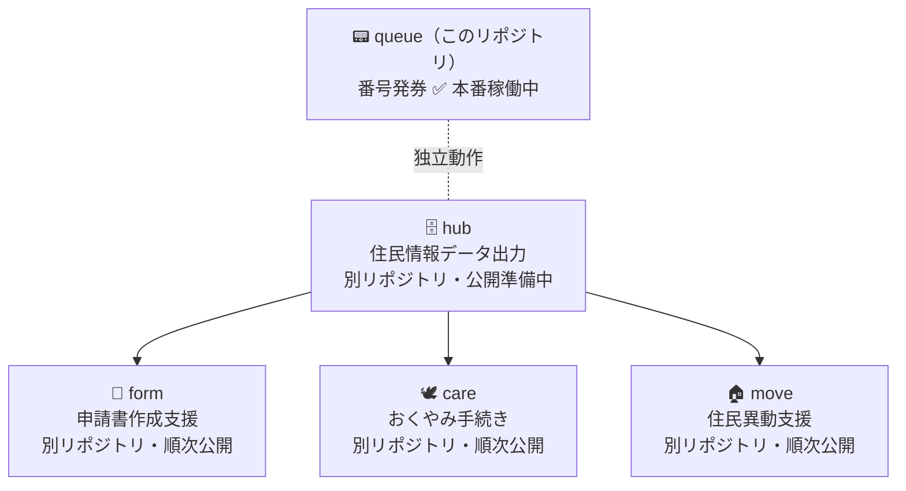

# MADO — Memuro Agile Desk Open

> An open-source counter service system built by and for small Japanese municipalities.


> 窓口に来た住民が、名前を55回書く。
> その問題を、現場の職員が自分で作って解決した。

北海道芽室町が開発・運用している行政窓口業務支援システム **MADO** のOSS版。
中・大規模向けSaaSではなく、**小規模自治体が現場で使い続けられるLITE版**として設計している。

> 📦 **このリポジトリは MADO の最初の公開パッケージ `queue`（番号発券システム）です。**
> hub / form / care / move は別リポジトリで順次公開予定（〜2026年10月）。全体像は [パッケージ構成](#パッケージ構成) を参照。

---

## Getting Started

`queue` は北海道芽室町の窓口で**本番稼働中**の番号発券システム。受付ネットワーク上で独立して動作し、庁内システムとのネットワーク接続は不要。

### Docker で起動（推奨）

```bash
git clone https://github.com/Memuro-Town/MADO-queue.git
cd MADO-queue
docker compose up --build
```

起動後、ブラウザで `http://localhost:8000` を開くと発券画面が立ち上がる。
初回起動時に自動でDBを初期化し、データは `data/numbers.db` に保存される。バックアップはこのファイルをコピーするだけ。

### ローカルで起動（Docker を使わない場合）

```bash
pip install -r requirements.txt
python init_db.py                                   # 初回のみ（DB初期化）
python app.py                                       # 開発サーバー
waitress-serve --host=0.0.0.0 --port=8000 app:app   # 本番起動（Waitress）
```

ビルド・テスト・DBリセット、および WSL（Windows）でのハマりどころは [docs/DEVELOPMENT.md](docs/DEVELOPMENT.md) を参照。


## リポジトリを読むための入口

このリポジトリでは、README は「初めて読む人の入口」、`docs/REQUIREMENTS.md` は業務要件、`docs/ARCHITECTURE.md` は実装リファレンス、`docs/DEVELOPMENT.md` は開発・運用手順として使い分けます。重複を避けるため、詳細な API・DB・印刷仕様は README ではなく既存 docs を参照してください。

### 主要ディレクトリ構成

| パス | 役割 |
|---|---|
| `app.py` | Flask アプリ本体。画面ルート、採番 API、処理管理 API、表示 API、印刷処理を含む。 |
| `init_db.py` | 新規 DB 作成時のスキーマとカテゴリ初期値を定義する。 |
| `safe_migrate_db.py` | 既存 DB に不足カラムを追加するための移行スクリプト。 |
| `config.py` | カテゴリごとの採番開始値を定義する。 |
| `templates/` | 発券画面、職員処理画面、公開表示画面の Jinja2 テンプレート。 |
| `static/` | 発券画面・表示画面で使う JavaScript と CSS。 |
| `docs/` | 要件、アーキテクチャ、開発・運用、監査メモ。 |
| `audit/` | マージしない PR や文書化試行の検証ログ。 |
| `data/` | 実行時に SQLite DB を置く場所。`numbers.db` はコミットしない。 |

### 主要ファイルの役割

- 業務上の目的・カテゴリ設計・非機能要件は [docs/REQUIREMENTS.md](docs/REQUIREMENTS.md) を参照してください。
- API、DB、画面、印刷、タイムゾーンの実装仕様は [docs/ARCHITECTURE.md](docs/ARCHITECTURE.md) を参照してください。
- Docker/ローカル起動、テスト、DB リセット、プリンター設定、トラブルシュートは [docs/DEVELOPMENT.md](docs/DEVELOPMENT.md) を参照してください。
- 文書化時の確認順序と再利用可能なチェックリストは [docs/DOCUMENTATION_PROCESS.md](docs/DOCUMENTATION_PROCESS.md) を参照してください。

### 開発・運用時の注意点

- 実データ保護のため、テストや検証で実運用の `data/numbers.db` を使わないでください。
- プリンターが接続されていない環境でも採番・DB 記録の確認は可能ですが、印刷失敗はログに出ます。
- `docs/ARCHITECTURE.md` と `docs/DEVELOPMENT.md` に既存の詳細があるため、同じ内容の新規文書を増やさず、既存文書へ統合する方針です。
- カテゴリ番号帯、日次リセット、プリンター失敗時の扱いなど、要件と実装の差分が疑われる箇所は監査対象として扱い、推測で断定しないでください。

### 未確認事項

- README 内の人口・来庁者数などの外部統計値は、この作業では再検証していません。
- 本番運用でのプリンター機種・Windows/WSL/Docker 構成の組み合わせは、コードと既存文書で確認できる範囲のみ記載しています。
- `audit/mado-queue-baseline` ブランチはこの作業環境では存在を確認できなかったため、今回の作業ブランチは作業開始時点の `work` ブランチから作成しました。


---

## なぜ作ったか

### 住民が名前を55回書く問題

転入・婚姻と国保、障害者手帳などの手続きが重なると、住民は同じ書類に何度も同じ情報を書き込む。
MADOは住民情報を一度読み込み、各申請書に自動転記することでこの負担を解消する（`form` パッケージ）。
`queue` はその窓口体験の入口として、来庁者の受付・番号発券・呼び出しを担う。

### 現場の職員が自分で作った

専門的なプログラミング知識のない窓口職員がAIを活用して開発した（Vibe Coding）。
基礎自治体の現場が開発した業務システムを、自治体公式OSSとして公開する。

### 芽室町の規模（参考）

同規模の自治体が導入を検討する際の目安として。

| 指標 | 数値 |
|---|---|
| 人口 | 17,454名（2026年3月31日現在） |
| 1日あたり来庁者数 | 163件（総合案内が設置された東側入口での計測） |
| 戸籍・住民票等発行件数 | 20,769枚（2025年実績） |
| 住民票異動件数 | 2,506件（2025年実績） |

---

## これは何か

| | MADO | 中・大規模向けSaaS |
|---|---|---|
| ターゲット | 小規模自治体（人口〜5万人程度） | 中・大規模自治体 |
| 導入コスト | ソフトウェアは無償（構築支援は別途） | 月額・初期費用あり |
| カスタマイズ | コードで自由に改変可 | ベンダー依存 |
| 設計思想 | 来庁者の不安解消・対話時間の確保 | 処理効率化 |

アナログとデジタルを組み合わせた設計。「速く処理する」より、システム導入により生まれる余力を「丁寧に寄り添う」窓口応対に充てることを優先している。

> ソフトウェア自体は無償だが、環境構築・DB設計・DB更新などが必要なため、構築支援の委託を想定している。

---

## 機能・画面構成（queue）

| URL | 説明 | 利用者 |
|-----|------|--------|
| `/` | 発券画面 | 来庁者（タブレット設置） |
| `/processing` | 処理画面 | 職員（呼び出し・対応操作） |
| `/display` | 案内表示 | ロビーモニター（大画面表示） |

導入はレシートプリンターと発券画面（`/`）のみの**スモールスタート**で始められる。

- **`/processing`** は後から追加した。待ち時間・処理時間のログ取得と、窓口を離れた職員が自席から混雑状況を把握できるようにするため。
- **`/display`** も後から追加した。音声呼び出しだけでは来庁者が気づかないケースがあるため、視覚でも呼び出し状況を確認できるように。

### カテゴリ番号帯

| カテゴリ | 番号帯 | 用途 |
|---------|--------|------|
| A | 001–499 | 一般窓口（初級） |
| B | 500–799 | 専門窓口（中級） |
| C | 800–   | その他（正職員） |
| D | —      | 印刷なし・来庁者カウント用 |

カテゴリの設計意図・2枚印字の理由・窓口運用モデルの詳細は [docs/ARCHITECTURE.md](docs/ARCHITECTURE.md)・[docs/REQUIREMENTS.md](docs/REQUIREMENTS.md) を参照。

---

## パッケージ構成



`queue` は受付ネットワーク上で独立して動作する。庁内システムとのネットワーク接続は不要で、住民の個人情報を扱わない設計になっている。
`hub` 以降はOSS公開に向けた整備が残っており、2026年10月までに順次公開予定。

---

## 技術スタック

### queue（このリポジトリ）
- **Framework**: Flask 3.x
- **Language**: Python 3.14
- **WSGI サーバー**: Waitress
- **Database**: SQLite（別途DBサーバー不要）
- **対応プリンター**: MUNBYN POS-80C（VID: `0x04b8` / PID: `0x0e20`・動作確認済み）
- **ブラウザ**: Chrome / Edge（最新版）

### hub / form / care / move（別リポジトリ）
- **Framework**: Next.js (App Router) / **Language**: TypeScript / **Database**: SQLite

---

## 3者の価値創造

| 主体 | 得られるもの |
|---|---|
| **芽室町** | 開発・維持コストを外部と分散できる。担当者が異動してもコミュニティが保守を支えるため、属人化を解消できる |
| **参画自治体** | 開発コストを抑えて現場で使えるシステムを導入できる。ただし芽室町での実運用実績はあるが、コード品質は保証されていない |
| **エンジニア・ベンダー** | 普段触れない行政ドメイン知識が得られ、本番稼働中の行政システムへ貢献できる。MITライセンスのため商用利用可。自治体への構築支援を通じた新規顧客獲得にも活用できる |

---

## 現在の状況と求めること

MADOは「解決したい課題は明確だが、技術力がない」という現場の職員がAIを活用して開発した（Vibe Coding）。窓口業務での実用には耐えているが、コードの品質・設計・テストの面では未成熟な部分が多い。

**現場が作ったプロダクトを、エンジニアコミュニティと一緒に育てたい。** 特に以下の点で力を借りたい：

- コードレビュー・リファクタリング
- DB設計の見直し（場当たり的な実装で、将来の拡張性が考慮できていない）
- テスト設計・自動化
- セキュリティ観点での確認
- 他自治体が導入しやすくなるための設計改善

行政ドメインの現場知識はこちらにある。技術的な知識を持つ人と組み合わさることで、より多くの自治体で使えるシステムになると考えている。

---

## Contributing

→ [CONTRIBUTING.md](CONTRIBUTING.md)

バグ報告・ドキュメント修正・設計議論、どこからでも歓迎する。各自治体の固有仕様はフォークで自由に派生してよい。**まず Issue（リポジトリ上部の "Issues" タブ）で話しかけてほしい。**

行動規範は [CODE_OF_CONDUCT.md](CODE_OF_CONDUCT.md)、脆弱性の報告は [SECURITY.md](SECURITY.md) を参照。

---

## 導入自治体

→ [FORKED_SITES.md](FORKED_SITES.md)

---

## License

MIT License — Copyright (c) Memuro Town

詳細は [LICENSE](LICENSE) を参照。

本リポジトリのコードは参考実装であり、各自治体での法令適合性・業務適合性は導入主体が確認すること。
